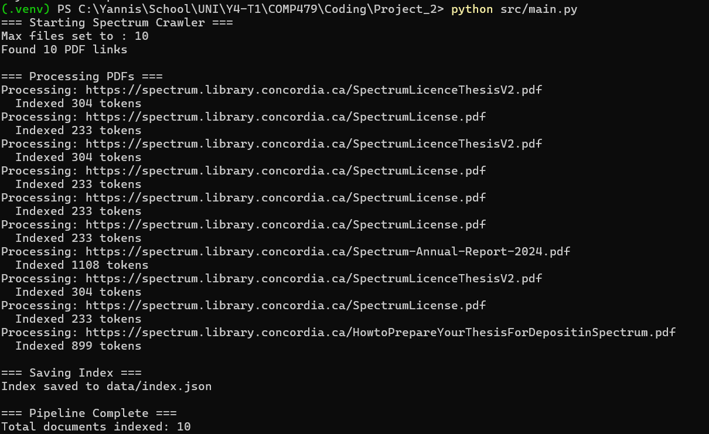

Demo – Project 2

Spectrum Crawler, Index, and Document Clustering

Note: For this demo, I re-ran the pipeline with max_docs = 10 so the execution is fast for marking.
All quantitative results and analysis in the Report are based on the full run with 50 PDFs.

# 1. Crawling & Robots.txt

The project starts from the Spectrum home page:

Start URL: https://spectrum.library.concordia.ca/

Domain restriction: only URLs under library.concordia.ca are visited.

The crawler is implemented in:

src/crawler/crawler.py

src/crawler/robots.py

src/crawler/utils.py

Before crawling, robots.txt is fetched and parsed by robots.py, and every candidate URL is checked against the allow/deny rules. Only URLs permitted for crawling are enqueued.

The demo run is launched with:

python src/main.py

In this run, max_docs is set to 10.
The terminal output (Figure 1) shows:

=== Starting Spectrum Crawler ===

Max files set to : 10

A list of 10 PDF URLs being processed

A message for each PDF like Indexed 304 tokens

Index saved to data/index.json

Total documents indexed: 10

# 2. Indexing & index.json

For each crawled PDF:

The file is downloaded temporarily.

src/index/pdf_extractor.py extracts the text using pdfminer.six.

src/index/tokenizer.py tokenizes, normalizes, and filters the text.

src/index/indexer.py updates the inverted index (term → {doc_id: frequency}).

The index and document metadata are saved via src/index/storage.py into:

data/index.json

The JSON file contains:

For each term: the document IDs and term frequencies.

For each document: its URL and basic metadata (e.g., total tokens).

Suggested screenshot: a small snippet of data/index.json showing a term with its document IDs and one documents entry.

# 3. Query Phase + Output

The query phase for the two assignment terms (“sustainability” and “waste”) is implemented in:

src/queries/run_queries.py

The script:

Calls load_index_json("data/index.json") from src/index/storage.py.

Uses get_docs_for_term(index, "sustainability") and get_docs_for_term(index, "waste") to obtain document sets.

Computes intersection and union:

Sustainability documents: 2

Waste documents: 2

Documents in both: 2

My-collection size (union): 2

These results come from the full 50-document index (not from the 10-document demo run).
The two matching documents are:

31 https://spectrum.library.concordia.ca/996224/1/Ali_PhD_F2025.pdf

32 https://spectrum.library.concordia.ca/id/eprint/996224/1/Ali_PhD_F2025.pdf

The script also writes:

data/sustainability_docs.txt

data/waste_docs.txt

data/my_collection.txt

NOTE: Here the screenshots will show 0 documents found for each keyword. Once again, this is because the screenshot was taken on a run with 10 pdf files only, on the actual run with 50 pdf's there were 2 results that were found for each term.

# 4. Clustering k = 2

Clustering is done in:

src/clustering/cluster.py

This module loads the index, builds a TF–IDF matrix, and runs KMeans for k = 2, 10, and 20. For each k, it saves:

data/clusters/k*/cluster_assignments.txt

data/clusters/k*/summary.json (top 50 TF–IDF terms per cluster)

data/clusters/k*/top_terms.txt

For k = 2, the clusters can be summarized as:

Cluster 0 — Administrative / Licensing / Repository Metadata
Dominant terms: submission, thesis, concordia, licence, copyright, repository, library, rights, grant, pdf, document.

Cluster 1 — Technical / Research Content
Dominant terms: pp, doi, vol, lenet, resnet, table, precision, recall, 2019, 2020, https.

This run cleanly separates boilerplate Spectrum content from actual research content.

# 5. Clustering k = 10

For k = 10, the TF–IDF space is partitioned into more specific themes. Examples:

Cluster “Formatting Instructions”
Terms like acrobat, adobe, pdf, naming, convert, save, mac, word.

Cluster “Copyright & Licence”
Terms like copyright, licence, rights, grant, consent, repository.

Cluster “Climate / Emissions Modelling”
Terms like ghg, mtco2, emissions, climatewatch, nationallydeterminedcontributions.

Cluster “Concrete / Materials Science”
Terms like mixtures, slag, viscosity, hydration, compressive, concrete.

Cluster “ML / Vision / Transformers”
Terms like lenet, mnist, resnet, visiontransformers, detr, arxivpreprint.

Cluster “Programming / Database Code”
Terms like java, sql, class, import, github, employee, dept.

This k-value gave the most interpretable grouping and is the basis for most of the qualitative discussion in the report.

Format same as the screenshot for k=2 consult data/k10/summary.json to see the whole file

# 6. Clustering k = 20

At k = 20, the clusters become very fine-grained. Some clusters remain meaningful (e.g., more specific ML clusters, concrete mixtures, power-electronics emulation, emissions modelling), but several clusters:

Are very small (few documents), or

Differ mostly by citation formatting or repeated repository text.

This demonstrates over-segmentation on a small corpus (50 documents). The run is still useful to show that the pipeline generalizes to other k-values, but k = 10 is more appropriate for interpretation.

Format same as the screenshot for k=2 consult data/k20/summary.json to see the whole file
# 7. Insights & Observations

Many Spectrum PDFs contain large blocks of repeated administrative and licensing text, which naturally forms its own clusters and must be taken into account when interpreting results.

The combination of TF–IDF + KMeans works well for separating boilerplate text from technical content, even on a relatively small corpus.

k = 2 reveals the high-level split between metadata and research content, while k = 10 provides the most meaningful topic-level structure (climate, materials, ML, programming, etc.).

k = 20 shows the limitation of using a large k on a small dataset: clusters become very narrow, with some dominated by formatting artifacts rather than true topics.

The query-based My-collection (documents containing both “sustainability” and “waste”) is extremely small (2 documents), which makes clustering on that subset alone unstable, illustrating why using the full index for DF and TF–IDF is important.

This demo run and screenshots show that each component—crawling, indexing, querying, and clustering—works end-to-end and that the outputs used in the written report are reproducible.